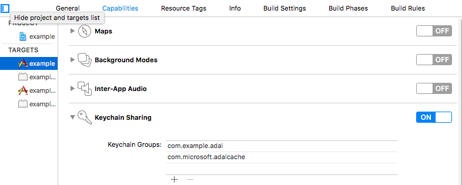

# iOS Setup: react-native-azure-adal

## Assumptions

You have a Azure AD Setup

You can find detailed instructions how to set up a new application in Azure AD [here](https://github.com/AzureADSamples/NativeClient-MultiTarget-DotNet#step-4--register-the-sample-with-your-azure-active-directory-tenant).

## Prerequisites

A working CocoaPods installation [CocoaPods - Getting Started](https://guides.cocoapods.org/using/getting-started.html)

## Step 1 - Pod Setup

- If CocoaPods is not installed, please run below commands:

```bash
pod init
```

- Add the ADAL ios library to your ios/Podfile file pod `'ADAL', '~> 2.3'`.

```
target 'example' do
  # Uncomment the next line if you're using Swift or would like to use dynamic frameworks
  # use_frameworks!

  # Add ADAL Pod
  pod 'ADAL', '~> 2.3'
  # Pods for example

  target 'exampleTests' do
    inherit! :search_paths
    # Pods for testing
  end

end

```

- Run below command to pull the ios ADAL library down.

```bash
pod install
```

## Step 2 - Installation

Install NPM module 

`$ npm install react-native-azure-adal --save`

OR 

`yarn add react-native-azure-adal`

## Step 3 - Linking

### Mostly automatic installation

	$ react-native link react-native-azure-adal

### Manual installation - iOS

1. In XCode, in the project navigator, right click `Libraries` ➜ `Add Files to [your project's name]`
2. Go to `node_modules` ➜ `react-native-azure-adal` and add `RNAzureAdal.xcodeproj`
3. In XCode, in the project navigator, select your project. Add `libRNAzureAdal.a` to your project's `Build Phases` ➜ `Link Binary With Libraries`
4. Run your project (`Cmd+R`)

## Step 4 - Caching and Broker

### Keychain Setup

Click on your project in the Navigator pane in Xcode. Click on your application target and then the **Capabilities** tab. Scroll down to **Keychain Sharing** and flip the switch on. Add `com.microsoft.adalcache` to that list.



___

### Broker support
Plugin automatically detects whether to enable brokered authentication based on redirectUri format (if starts with `x-msauth-`).
Developer needs to register special redirectUri for broker usage following format below:

```
x-msauth-<your-bundle-id>://<your.bundle.id>
ex: x-msauth-com-microsoft-mytestiosapp://com.microsoft.mytestiosapp
```

Read [ADAL for iOS](https://github.com/AzureAD/azure-activedirectory-library-for-objc#brokered-authentication) to understand broker concept in more details.


## TroubleShooting

Receiving issues After an update? Please:

- Ensure this module is up to date
- If you are still receiving issues after all this then open an issue.

Thanks


